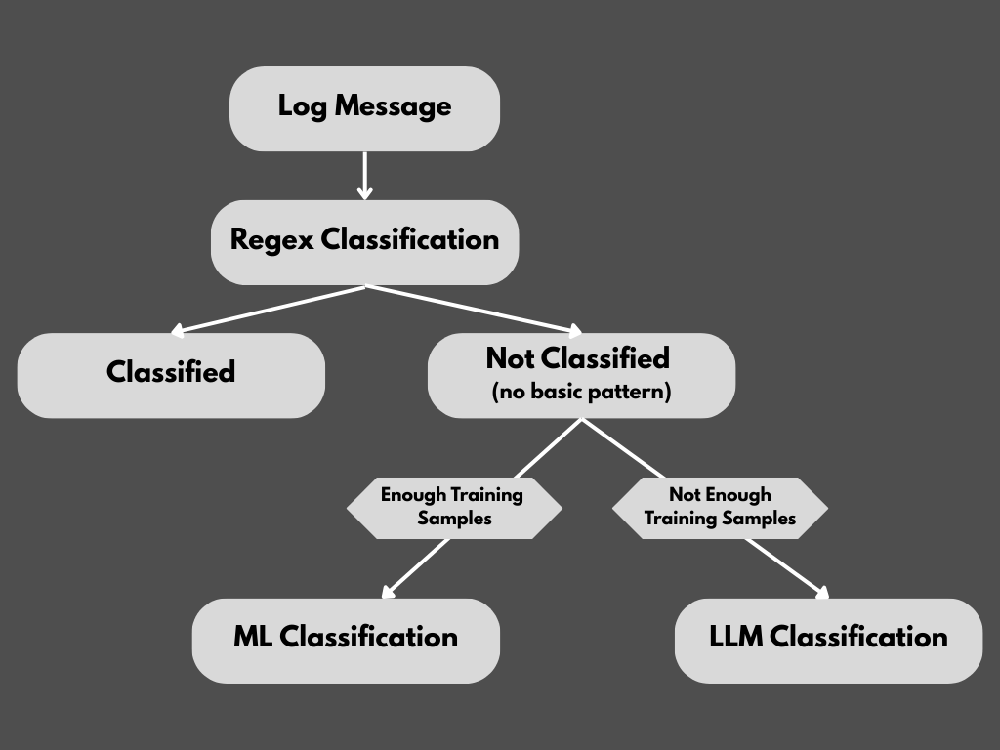

# Hybrid Log Classification System

- A log classification system that classifies log messages from multiple sources using a **hybrid approach (Regex → ML → LLM)**.  
  - Out of 1410 logs: **~500 were classified instantly using Regex**, **~900 via ML**, and only **7 needed LLM**, making it both **fast and cost-efficient**.
- Supports batch classification from CSV files and outputs labeled results.- Supports batch classification from CSV files and outputs labeled results. 


## Architecture

<p align="center">
  
</p>

## Tech Stack

- **Language**: Python
- **Framework**: FastAPI
- **ML/LLM**: Custom ML model (Joblib), LLM-based classification
- **Data Handling**: Pandas
- **Deployment**: Uvicorn / Gunicorn


## Folder Structure

```
hybrid-log-classifier/
│
├── assets/
│   └── archi.png
│
├── DATASET/
│   ├── output.csv
│   ├── synthetic_logs.csv
│   └── test.csv
│
├── models/
│   └── log_classifier.joblib
│
├── .gitignore
├── app.py                       # fastapi server  
├── classifier_helper.py         # classifier functions for all three methods
├── main.py                      # final Classification 
├── log_classifier.ipynb         # notebook
├── requirements.txt
└── README.md
```


## Setup & Installation

```bash
# Clone the repository
git clone https://github.com/your-username/log-classifier.git
cd log-classifier

# Create and activate virtual environment (optional but recommended)
python -m venv .venv
source .venv/bin/activate    # On Windows: .venv\Scripts\activate

# Install dependencies
pip install -r requirements.txt

# Create environment file for API keys
cp .env.example .env

# Add your OpenAI API key to .env file
echo "OPENAI_API_KEY=your_openai_api_key_here" >> .env
```
**Note**: Make sure to replace `your_openai_api_key_here` with your actual OpenAI API key in the `.env` file and **do not push this file to version control**.

##  Usage

### Run on a CSV

```bash
python main.py
```

This will:
- Read `test.csv` from the `DATASET/` folder
- Classify each log entry
- Save the output as `output.csv` in the same folder

### Run FastAPI Server (Optional)

```bash
uvicorn app:app --reload
```

Then test the API endpoints using Postman at: http://127.0.0.1:8000/classify

## Acknowledgements

- [FastAPI](https://fastapi.tiangolo.com/) for the backend framework
- [Pandas](https://pandas.pydata.org/) for CSV handling
- [Joblib](https://joblib.readthedocs.io/) for model persistence
- [OpenAI](https://openai.com/) (if using their LLMs for classification)


## License

[](https://opensource.org/licenses/MIT)

This project is licensed under the MIT License - see the [LICENSE](LICENSE) file for details.


## Contributing

Contributions are welcome! Please feel free to submit a Pull Request.